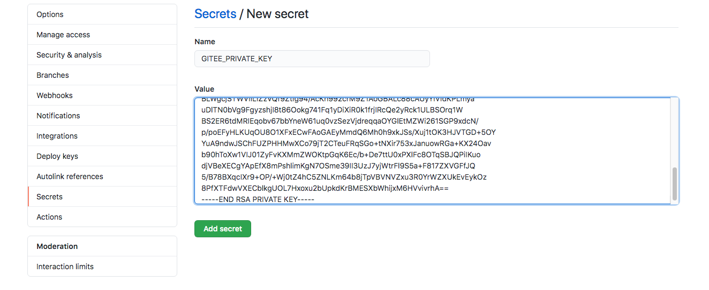
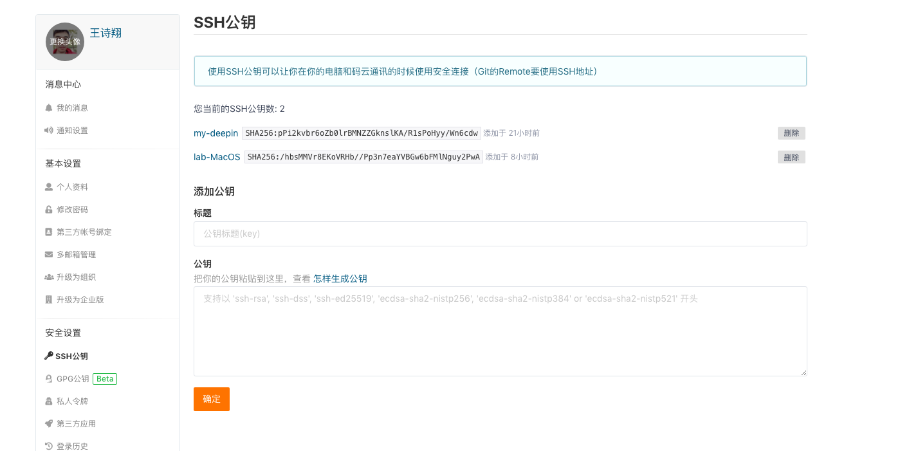
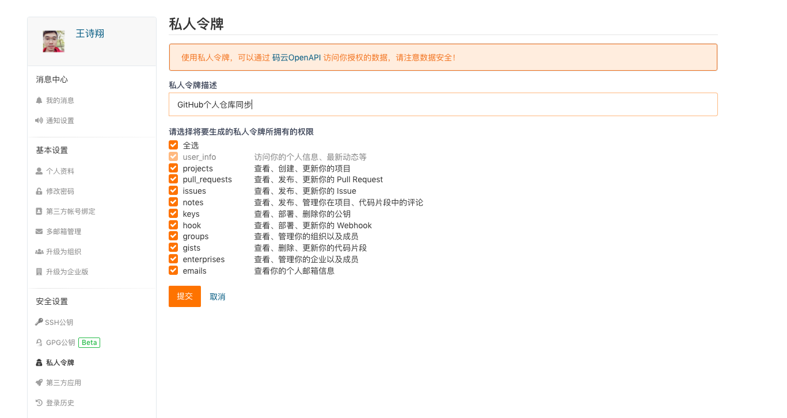
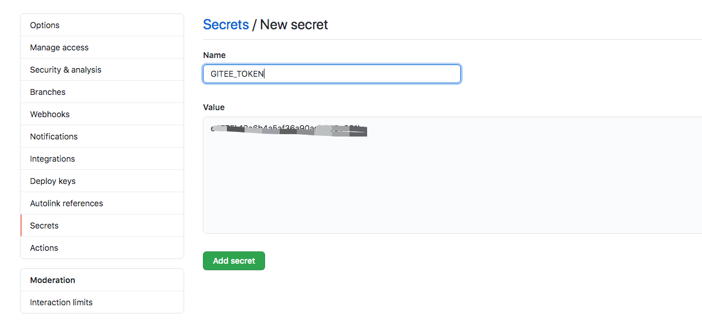

# 自动镜像 GitHub 仓库到 Gitee

> Auto-Sync GitHub Repositories to Gitee

 [](https://raw.githubusercontent.com/ShixiangWang/sync-deploy/master/LICENSE)


基于 action <https://github.com/Yikun/hub-mirror-action> 实现。

首先你需要通过搜索了解下什么是 GitHub Action，它的配置文件在仓库的 `.github/workflows` 下面。然后 Fork 本仓库，或者自己新建一个仓库（但需要自己添加 [Action 配置文件](https://github.com/ShixiangWang/sync2gitee/blob/master/.github/workflows/sync.yml)）。

1. 基于 SSH 配置公钥和私钥，[参考]([https://github.com/ShixiangWang/sync-deploy#%E5%87%86%E5%A4%87%E4%B8%8E%E9%85%8D%E7%BD%AE](https://github.com/ShixiangWang/sync-deploy#准备与配置))或网上N多资料。

2. 将私钥传到 GitHub 仓库，通过设置中的 Secrets 创建一个 `GITEE_PRIVATE_KEY` 变量，将私钥内容拷贝到值区域

    

3. 同理将公钥传到 Gitee 上，这样就可以实现 GitHub 和 Gitee 的通信

    

4. 在 Gitee 上创建一个私人令牌（token），这个记得保存，因为它只会出现一次

    ​

5. 类似第 2 步，创建一个 `GITEE_TOKEN` 变量，将私人令牌作为值粘贴进去。

    

6. 将配置文件中的源和目标设置为你自己的账号即可。

    ```
    src: github/<这里改成自己的GitHub名字>
    dst: gitee/<这里改成自己的Gitee名字>
    ```


这样配置就完成了。提交你的修改，GitHub Action 就会开始启动并工作了。

> 注意，如果你一开始 Fork 了本仓库或自己创建了工作流文件，Action 也会启动，但由于没有进行秘钥和 Token 的配置，所以 GitHub 无法和 Gitee 通信等。配置好后的流程才是有效的。


你还可以根据自己的实际情况修改配置，以下是有用的参考：

- <https://github.com/Yikun/hub-mirror-action>
- <https://docs.github.com/en/actions>

- [crontab的语法规则格式（每分钟、每小时、每天、每周、每月、每年定时执行 规则）](https://blog.csdn.net/xinyflove/article/details/83178876)